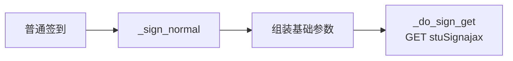
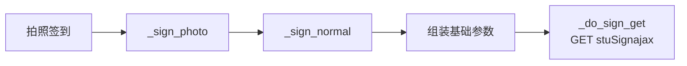
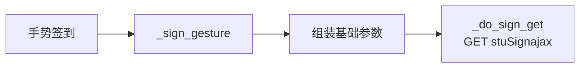
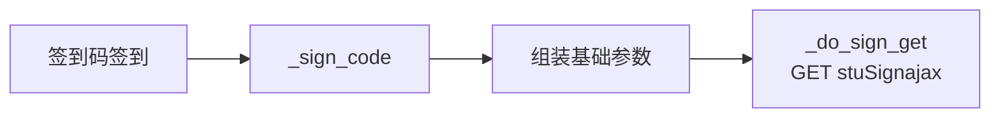
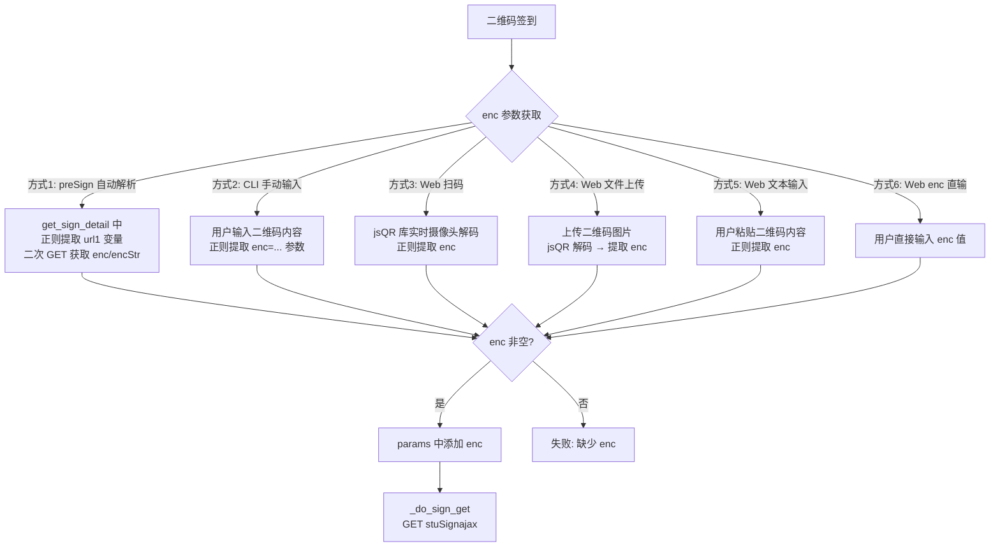
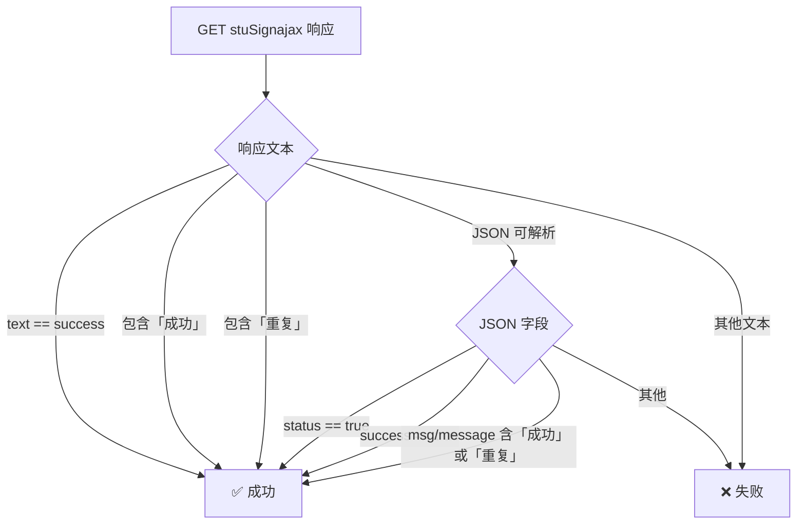

# 超星学习通签到工具 — 架构与实现文档

## 一、项目概览

本项目通过模拟超星学习通 Android 客户端的 HTTP 请求，实现对六种签到类型的自动化签到。提供 **命令行交互（CLI）** 和 **Web 服务（FastAPI）** 两种使用方式。

### 技术栈

| 层级 | 技术 |
|------|------|
| HTTP 请求 | `requests.Session`，模拟 Android UA |
| CLI 入口 | `main.py`（交互式命令行） |
| Web 服务 | `server.py`（FastAPI + uvicorn） |
| 前端 | 原生 HTML/CSS/JS，集成 jsQR 扫码、高德地图选点 |
| HTML 解析 | `BeautifulSoup` + `lxml` + 正则 |
| 测试 | `pytest` + `pytest-mock` |

---

## 二、项目整体流程图

```mermaid
flowchart TD
    subgraph 入口
        A[用户启动] --> B{选择模式}
        B -->|CLI| C[main.py]
        B -->|Web| D[server.py]
    end

    subgraph 登录模块
        C --> E[加载 config.json]
        D --> E
        E --> F[获取凭据: 环境变量 > 配置文件 > 手动输入]
        F --> G[ChaoxingClient.login]
        G --> H1[GET passport2.chaoxing.com/login<br/>获取初始 Cookie]
        H1 --> H2[POST passport2.chaoxing.com/fanyalogin<br/>提交手机号 + 明文密码]
        H2 --> H3{判断登录结果}
        H3 -->|HTML 含「登录成功」| I[登录成功]
        H3 -->|JSON status=true| I
        H3 -->|Cookie 含 UID| I
        H3 -->|均不满足| J[登录失败, 退出]
        I --> K[获取用户信息<br/>SSO API → uid + name]
    end

    subgraph 课程模块
        K --> L[get_courses]
        L --> M[GET mooc1-api.chaoxing.com/mycourse/backclazzdata]
        M --> N[解析 channelList<br/>过滤 cataid=100000002]
        N --> O[提取 course.data[] → Course 列表]
    end

    subgraph 签到任务模块
        O --> P[get_sign_tasks]
        P --> Q[GET mobilelearn.chaoxing.com/ppt/activeAPI/taskactivelist<br/>参数: courseId, classId]
        Q --> R[过滤 activeType=2 签到类活动]
        R --> S[通过名称中文关键字匹配 SignType]
        S --> T[返回 SignTask 列表<br/>按 active/ended 分组]
    end

    subgraph 签到详情模块
        T --> U[get_sign_detail]
        U --> V[GET task.raw_url<br/>获取 preSign HTML]
        V --> W[正则提取 acId]
        W --> X{签到类型?}
        X -->|二维码| Y[解析 url1 变量<br/>二次请求获取 enc]
        X -->|其他| Z[直接返回]
    end

    subgraph 执行签到
        Z --> AA{SignType 路由}
        Y --> AA
        AA --> AB[普通签到]
        AA --> AC[拍照签到]
        AA --> AD[手势签到]
        AA --> AE[签到码签到]
        AA --> AF[位置签到]
        AA --> AG[二维码签到]
        AB --> AH[_do_sign_get<br/>GET stuSignajax]
        AC --> AH
        AD --> AH
        AE --> AH
        AF --> AH
        AG --> AH
        AH --> AI{响应判断}
        AI -->|text='success'| AJ[签到成功]
        AI -->|含'成功'或'重复'| AJ
        AI -->|JSON status/success=true| AJ
        AI -->|其他| AK[签到失败]
    end
```

---

## 三、各签到类型实现逻辑

### 3.1 签到类型识别

`SignType.from_chinese(name)` 通过活动名称中的中文关键字匹配签到类型：

| 关键字 | 枚举值 | 说明 |
|--------|--------|------|
| "普通" | `NORMAL` | 普通签到 |
| "拍照" | `PHOTO` | 拍照签到 |
| "手势" | `GESTURE` | 手势签到 |
| "位置" | `LOCATION` | 位置签到 |
| "二维码" | `QRCODE` | 二维码签到 |
| "签到码" | `CODE` | 签到码签到 |
| 无匹配 | `NORMAL` | 默认回退为普通签到 |

---

### 3.2 通用请求参数

所有签到类型最终都调用 `_do_sign_get()`，向 `https://mobilelearn.chaoxing.com/pptSign/stuSignajax` 发送 GET 请求。基础参数为：

| 参数 | 值 | 说明 |
|------|-----|------|
| `activeId` | 活动 ID | 从 preSign HTML 或任务 URL 中提取 |
| `courseId` | 课程 ID | 来自课程列表 |
| `uid` | 用户 UID | 登录后获取 |
| `clientip` | `""` | 空字符串 |
| `useragent` | `""` | 空字符串 |
| `latitude` | `"-1"` | 默认 -1（位置签到会覆盖） |
| `longitude` | `"-1"` | 默认 -1（位置签到会覆盖） |
| `appType` | `"15"` | 固定值，表示 Android 客户端 |
| `fid` | `"0"` | 固定值 |

---

### 3.3 普通签到 (`SignType.NORMAL`)



**实现逻辑**：直接使用基础参数调用签到接口，无需任何额外数据。这是最简单的签到类型。

**代码路径**：`client.py:363-365` → `_sign_normal()` 直接委托给 `_do_sign_get()` 并传入基础参数。

---

### 3.4 拍照签到 (`SignType.PHOTO`)



**实现逻辑**：完全等同于普通签到，**不实际上传任何图片**。服务端会接受签到请求，但教师端看到的签到记录中无照片。

**代码路径**：`client.py:367-369` → `_sign_photo()` 直接调用 `_sign_normal()`，不传额外参数。

---

### 3.5 手势签到 (`SignType.GESTURE`)



**实现逻辑**：直接使用基础参数调用签到接口，**不需要知道教师设置的具体手势图案**。服务端不校验手势数据。

**代码路径**：`client.py:371-373` → `_sign_gesture()` 直接调用 `_do_sign_get()`。

---

### 3.6 签到码签到 (`SignType.CODE`)



**实现逻辑**：直接使用基础参数调用签到接口，**不需要输入任何签到码**。服务端不校验签到码内容。

**代码路径**：`client.py:375-377` → `_sign_code()` 直接调用 `_do_sign_get()`。

---

### 3.7 位置签到 (`SignType.LOCATION`)

```mermaid
flowchart TD
    A[位置签到] --> B{经纬度来源}
    B -->|CLI 用户输入| C[手动输入 lng,lat]
    B -->|CLI 使用默认| D[config.json location 字段<br/>默认: 116.404, 39.915 北京]
    B -->|Web 地图选点| E[高德地图点击获取坐标]
    B -->|Web 使用默认| F[/api/location_config]
    C --> G[覆盖 params 中的<br/>latitude + longitude]
    D --> G
    E --> G
    F --> G
    G --> H[_do_sign_get<br/>GET stuSignajax]
```

**实现逻辑**：
1. 基础参数中 `latitude="-1"`, `longitude="-1"`
2. 用自定义坐标覆盖这两个字段
3. 默认坐标为北京天安门附近（116.404, 39.915），可在 `config.json` 中配置
4. Web 端嵌入高德地图 JS API，用户可以在地图上点击选点并获取逆地理编码地址

**代码路径**：
- `client.py:379-387` → `_sign_location()` 从 kwargs 或 task 属性中获取经纬度，覆盖后调用 `_do_sign_get()`
- `main.py:196-209` → CLI 端提示用户输入或使用配置默认值
- `server.py:163-166` → Web 端合并前端传来的坐标或使用默认值

---

### 3.8 二维码签到 (`SignType.QRCODE`)



**实现逻辑**：
1. 二维码签到需要在请求参数中携带 `enc` 字段
2. `enc` 有六种获取途径（一种自动 + 五种手动）：
   - **自动**：`get_sign_detail()` 从 preSign HTML 中正则提取 `url1` 变量的值，再 GET 该 URL 获取 JSON 中的 `enc` 或 `encStr` 字段
   - **CLI 手动**：提示用户粘贴二维码内容，正则提取 `enc=xxx`
   - **Web 扫码**：使用 jsQR 库调用摄像头实时解码二维码
   - **Web 文件**：上传二维码图片文件，用 jsQR 解码
   - **Web 文本**：粘贴二维码文本内容，正则提取 enc
   - **Web enc 直输**：直接输入 enc 参数值

**代码路径**：
- `client.py:389-403` → `_sign_qrcode()` 优先级：kwargs["enc"] > task.enc > 从 qr_content 中正则提取
- `client.py:312-322` → `get_sign_detail()` 中自动解析 enc
- `main.py:187-193` → CLI 端提示手动输入
- `server.py:161-162` → Web 端直接传递 enc

---

## 四、签到结果判断

`_do_sign_get()` 通过以下优先级判断签到是否成功：



注意："重复" 也被视为成功，表示已经签到过了。

---

## 五、API 端点映射

超星服务端 API 端点汇总：

| 端点 | 方法 | 用途 |
|------|------|------|
| `passport2.chaoxing.com/login` | GET | 获取登录页初始 Cookie |
| `passport2.chaoxing.com/fanyalogin` | POST | 提交手机号密码登录 |
| `sso.chaoxing.com/apis/login/userLogin4UAP.do` | GET | 获取登录用户 UID/姓名 |
| `mooc1-api.chaoxing.com/mycourse/backclazzdata` | GET | 获取课程列表 |
| `mobilelearn.chaoxing.com/ppt/activeAPI/taskactivelist` | GET | 获取活动任务列表 |
| `mobilelearn.chaoxing.com/pptSign/stuSignajax` | GET | **执行签到（核心接口）** |

---

## 六、项目文件结构

```
chaoxing-sign-python/
├── main.py                          # CLI 入口：交互式命令行工具
├── server.py                        # Web 入口：FastAPI REST 服务
├── config.example.json              # 配置文件模板
├── config.json                      # 实际配置（含凭据，gitignore）
├── requirements.txt                 # Python 依赖
├── chaoxing_sign/                   # 核心包
│   ├── __init__.py                  # 包导出
│   ├── __main__.py                  # python -m 支持
│   ├── client.py                    # 核心 API 客户端（登录/课程/签到）
│   ├── types.py                     # 数据类型（枚举/数据类）
│   └── utils.py                     # 工具函数（正则/JSON/加密）
├── static/                          # Web 前端
│   ├── index.html                   # SPA 页面
│   ├── css/style.css                # 样式
│   └── js/app.js                    # 前端逻辑（含 jsQR + 高德地图）
└── tests/
    ├── test_all.py                  # 核心单元测试
    └── test_code.py                 # 签到码签到补充测试
```

---

## 七、数据模型

```
SignType (Enum)
├── NORMAL    ← "普通"
├── PHOTO     ← "拍照"
├── GESTURE   ← "手势"
├── LOCATION  ← "位置"
├── QRCODE    ← "二维码"
└── CODE      ← "签到码"

Course (dataclass)
├── course_id, class_id, name
├── teacher, cover_url

SignTask (dataclass)
├── active_id, name, course_name
├── course_id, class_id, sign_type
├── status ("active"/"ended")
├── start_time, end_time, raw_url
└── enc, location_latitude, location_longitude, location_name

AccountInfo (dataclass)
└── uid, name, school, avatar
```
